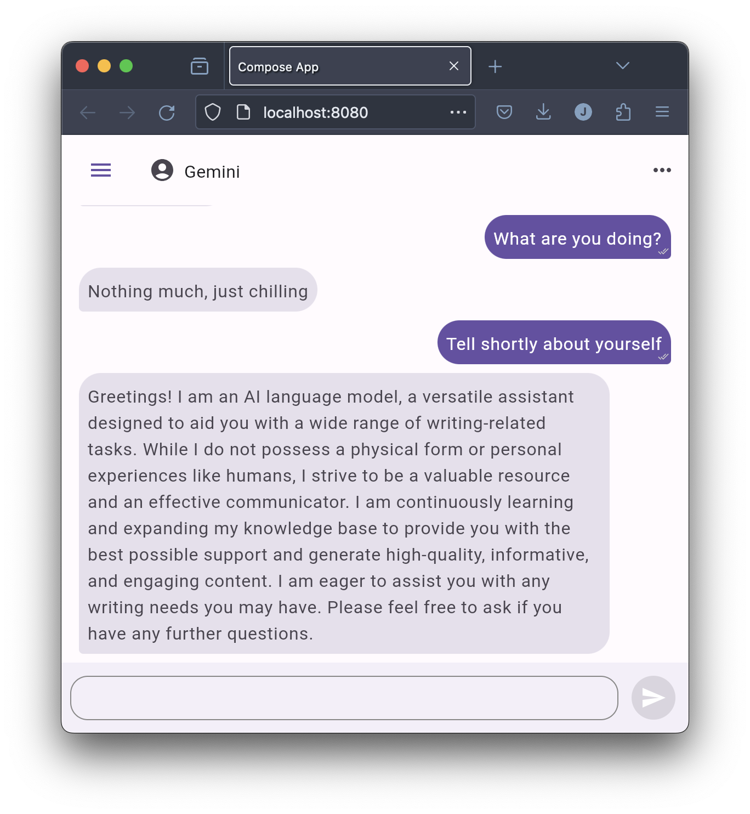

This is a Kotlin Multiplatform project targeting Android, iOS, Web, Desktop.

### Project Structure

* `/composeApp` is for code that will be shared across your Compose Multiplatform applications.
  It contains several subfolders:
  - `commonMain` is for code that’s common for all targets.
  - Other folders are for Kotlin code that will be compiled for only the platform indicated in the folder name.
* `/domain` is for shared code that is not UI-specific.

### UI

The UI is built using Jetpack Compose. The main UI code can be found in the `ui/chat` directory.

You can open the web application by running the `:composeApp:wasmJsBrowserDevelopmentRun` Gradle task.

## Screenshot and Video
